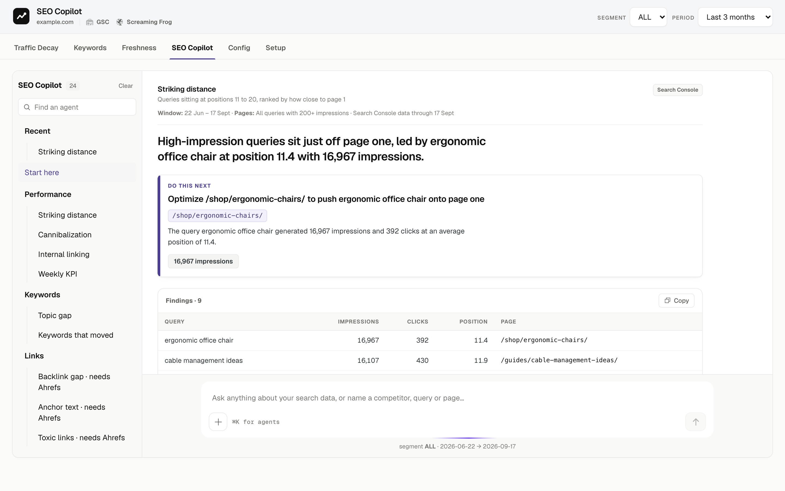
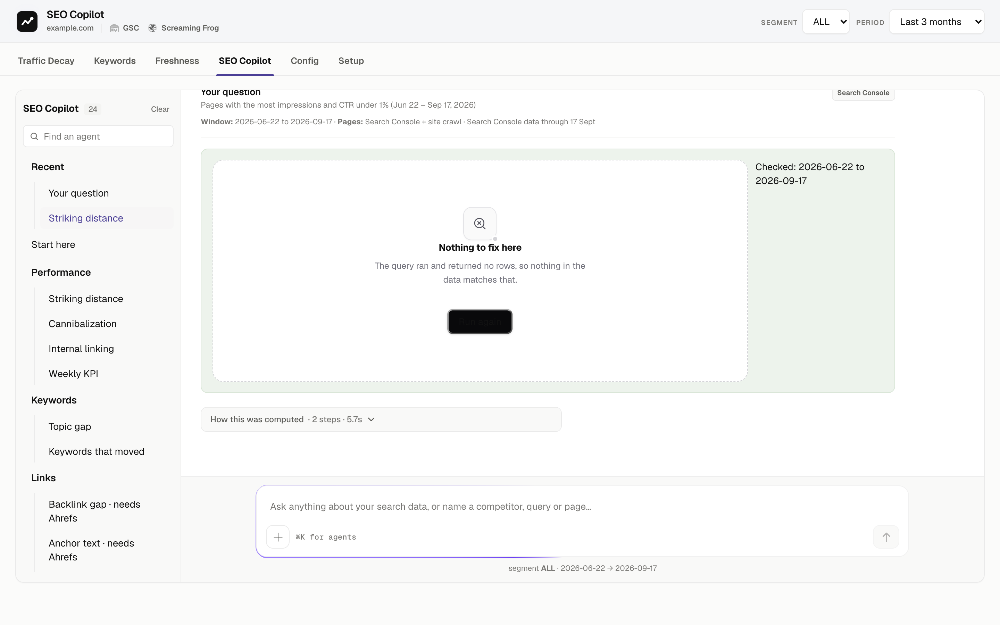
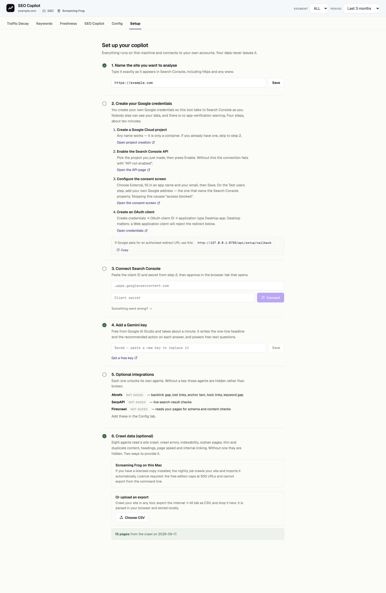

# SEO Copilot

Agentic SEO on your own Search Console data. Clone it, connect your property, and
get answers grounded in your own numbers. Everything runs on your machine.

## Why this is not "an LLM plus the GSC API"

Wiring a model to an API gets you confident sentences about data it half-read. This
tool is built the other way round.

- **Deterministic SQL produces every table.** The model writes only the one-line
  headline and the recommended action, and both are checked against the evidence
  before you see them. Any number it invents is stripped.
- **A diagnosis column is computed in SQL** and states a measurement, never a cause.
  "Clicks fell 44%" is a fact. "The content is stale" is a guess, so it is not said.
- **Fail-closed.** If a data source fails, results are withheld rather than reported
  as an absence. A missing value is never rendered as a zero — that single rule
  prevents most of the confident nonsense these tools produce.
- **Scoped to pages that matter.** Agents run over a computed page universe, your
  product hubs plus your top pages by traffic, not a random sweep of every URL.



*Every answer leads with the finding, names one action, and shows the evidence it came
from. Agents whose API key you have not added are visibly locked rather than broken.*

## What you get

**24 agents**, grouped by what you are trying to do: content decay with a
keep/update/merge/kill verdict per page, striking distance, cannibalisation,
internal linking, topic and keyword gaps, backlinks, crawl and indexing, thin and
duplicate content, titles, page speed, and a site health brief.

**Ask anything.** When no agent fits your question, a planner writes one read-only
SELECT against your tables and runs it. It sees the conversation, so "show me the
top 5 of those" resolves against the previous answer instead of guessing.



**A weekly brief** by email, with week-over-week and month-over-month traffic,
gainers and losses, and pages published in the period.

## Requirements

| | |
|---|---|
| Node | 20 or newer |
| A Search Console property | you must be an owner or full user |
| A Gemini API key | free, from [AI Studio](https://aistudio.google.com/apikey) |
| Ahrefs, SerpAPI, Firecrawl | optional, each unlocks its own agents |
| Screaming Frog | optional, or upload a crawl CSV instead |

## Install

```bash
git clone https://github.com/<you>/seo-copilot.git
cd seo-copilot
npm install
npm run db:init      # creates the local database
npm run dev          # http://localhost:8788
```



Open the **Setup** tab and work through the steps. It walks you through creating
your own Google OAuth client, which takes about ten minutes and means your data never
passes through anyone else's servers. See
[docs/connect-search-console.md](docs/connect-search-console.md) if you prefer to read
it first.

## Without a Gemini key

The tool still works. Every agent runs and shows its evidence table, which is the part
that comes from your data. What stops is the written headline, the recommended action,
and free-text questions, since those need a model.

## Verification

Three checks run against real output, not mocks:

```bash
node scripts/known-answers.mjs   # facts you can verify by eye
node scripts/judge.mjs           # a second model grades each agent's output
node scripts/sweep.mjs           # every agent, live, asserting the contract
```

The judge exists because a passing test suite is not enough. A column saying "clicks
down" under a heading that promises a verdict is perfectly true and perfectly useless,
and only reading the actual output catches that.

## Licence

MIT.
